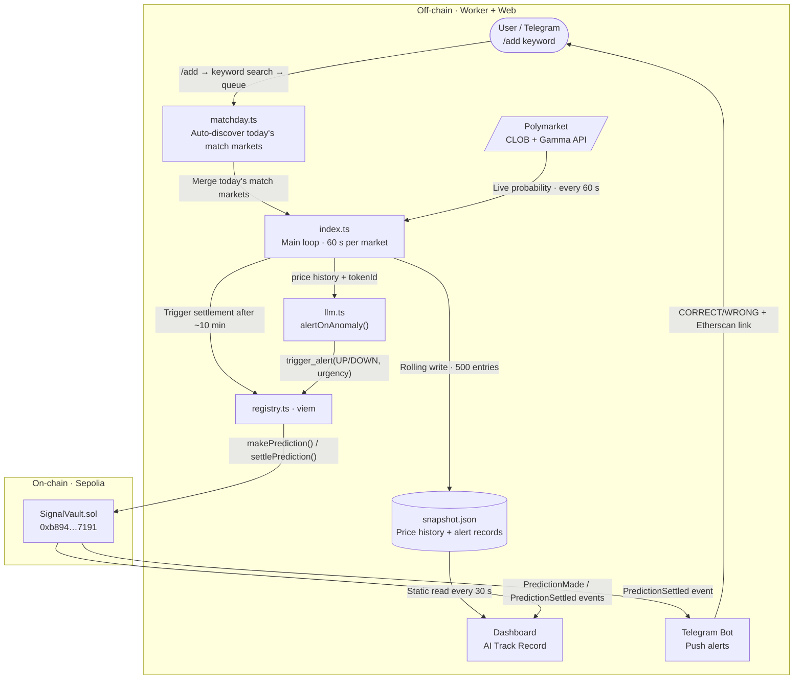
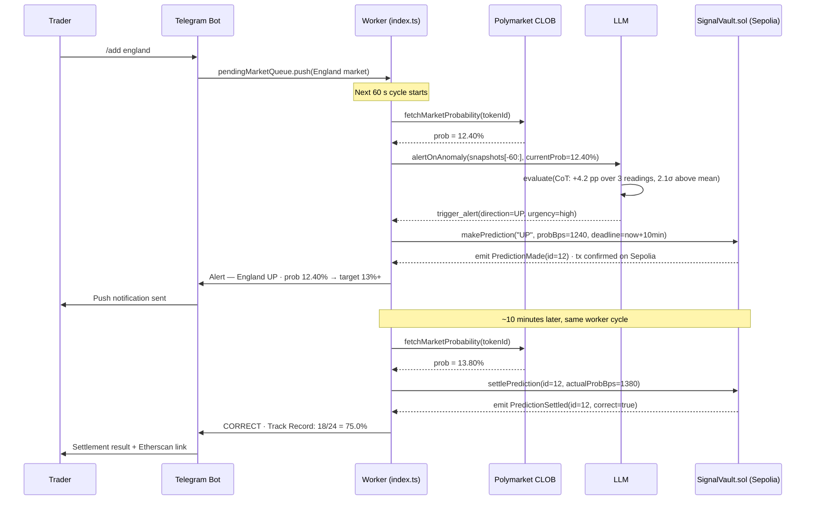

# AI Blackbox · Commit first. Score later.

> Built for in-play traders and market researchers.
> AI locks every call on-chain before results. Ten minutes later, it grades itself.
> Not "AI says it's accurate." Proof on Sepolia that it is — or isn't.

**Status:** 16 World Cup markets monitored live · SignalVault.sol deployed · Telegram bot online

[](https://ai-blackbox.vercel.app)
[](https://sepolia.etherscan.io/address/0xb894f59EE1531FA17cebb90D6d80E0A0fb597191)
[](https://github.com/ljwbpng09/ai-blackbox)
[](https://dorahacks.io/hackathon/croo-hackathon/detail)

---

## The Problem

You're watching five games at once. Odds shift hard. You have seconds.
Most tools send you an alert. Then they rewrite history.
After the match, every AI "called it." You never saw the original.

Without a binding commitment, AI accuracy is a number anyone can edit.

## The Fix

**AI Blackbox** forces a commitment before results arrive.
Each call — direction, probability, timestamp — gets sealed on Sepolia. No edits. Ever.
Ten minutes later, real prices settle each prediction automatically.
Check it on Etherscan. No account needed. No trust required.

> Web2 logs. Blockchain proves. No central operator can edit a chain event.

---

## Demo

| Landing Page | Telegram Bot — 16 markets live |
|---|---|
|  |  |

- **Live:** [ai-blackbox.vercel.app](https://ai-blackbox.vercel.app)
- **Contract:** [`0xb894...7191`](https://sepolia.etherscan.io/address/0xb894f59EE1531FA17cebb90D6d80E0A0fb597191) on Sepolia — filter `PredictionMade` + `PredictionSettled` events to audit
- **Try it now:** Send `/add france` to [@Hackcamp_bot](https://t.me/Hackcamp_bot) — market joins monitoring in ~60 s

---

## How it Works

### Architecture



### One Prediction, Start to Finish



> Deep dive: [docs/architecture.md](docs/architecture.md) · Contract interface: [docs/contract.md](docs/contract.md)

---

## Tech Stack

| Tech | Role | Why this, not alternatives |
|---|---|---|
| **Polymarket** CLOB + Gamma API | Live prices + match-day market discovery | Largest prediction market. World Cup 2026 volume >$67M/day — highest liquidity for AI accuracy testing |
| MiniMax LLM (OpenAI-compatible) | Anomaly detection + Function Calling decisions | Swap providers by changing one `baseURL` line. No LLM lock-in |
| Viem + Sepolia | On-chain reads and writes | Type-safe. `simulateContract` validates before broadcast — no wasted gas |
| SignalVault.sol | Two-step prediction lifecycle | Minimal state machine: `makePrediction` → `settlePrediction`. Low gas |
| Next.js 15 App Router | Dashboard + Landing | Server Components read snapshot.json statically. Zero backend cost |
| Telegram Bot API | Push alerts + interactive commands | `/add england` runs live during demos. Judges can try it themselves |
| **CROO CAP** | A2A monetization layer | See "Built for CROO" below |

---

## Built for CROO

**Tracks:** DeFi / On-chain Ops Agents · Data & Verification Agents

### Why AI Blackbox fits CAP natively

Every `settlePrediction` event creates a public, immutable accuracy data point.
Before hiring AI Blackbox through CAP, any buyer agent can query that on-chain track record.
They pay only when they trust the signal. Web2 APIs can't provide that baseline.

**Integration path (W3-P5 — completing before hackathon deadline):**

```
Any Agent (buyer)
    │  CAP call: analyzeMarket(tokenId, budget=5 USDC)
    ▼
AI Blackbox Agent endpoint
    │  Runs alertOnAnomaly(), returns { direction, confidence, onChainProofId }
    ▼
Buyer verifies onChainProofId on Etherscan, checks historical accuracy, decides next action
```

**Current state:** On-chain logic (SignalVault.sol) and AI decision engine (alertOnAnomaly) both run in production.
CAP endpoint wrapping — exposing the function as a payable A2A service — is the final sprint task.

---

## Why Now · Why This Team

**Why now:** World Cup 2026 is **Polymarket**'s largest single event ever. Liquidity peaks this month.
In-play odds shift in seconds. Traders need signals they can trust. Nobody can verify AI accuracy today.
That gap closes when the tournament ends. Now is the right moment to build a verifiable benchmark.

**Why this team:** Three weeks. Zero to shipped:
Multi-market Polymarket polling. LLM Function Calling decision engine. Two-step on-chain prediction lifecycle.
Telegram bot with live `/add` command. Auto match-day market discovery. Full-stack Dashboard on Vercel.
Every feature ships with a chain TX or a public URL — not a slide deck screenshot.

---

## Roadmap

### Done

| Phase | Delivered | Proof |
|---|---|---|
| W2-D1 | Polymarket polling + Dashboard | [ai-blackbox.vercel.app/dashboard](https://ai-blackbox.vercel.app/dashboard) |
| W2-D4 | Two-step prediction lifecycle | [`0xb894...7191`](https://sepolia.etherscan.io/address/0xb894f59EE1531FA17cebb90D6d80E0A0fb597191) |
| W3-P2 | Multi-market monitoring (16 simultaneous) | Dashboard market tabs |
| W3-P3 | Telegram push alerts + settlement results | @Hackcamp_bot |
| W3-P4 | Auto match-day market discovery | Detects markets on each startup |
| W3-P4b | `/add <keyword>` live market add | Live demo-ready |

### Next 4 weeks

- **CROO CAP endpoint** — wrap `alertOnAnomaly` as a standard payable A2A service; list on CROO Agent Store; milestone: first paid A2A call executed
- **Track Record API** — open `/api/accuracy?tokenId=...` so any agent can query win rate before paying
- **Dashboard one-click audit** — link each prediction directly to its Etherscan TX

### 3–6 months

- **Agent reputation layer** — Track Record becomes a standardized trust score in CAP markets; target: ≥10 external agents query it
- **Multi-event expansion** — extend from World Cup to elections and tournaments; keep "high liquidity + short settlement window" filter; target: ≥3 non-WC markets, ≥100 predictions each
- **CAP subscription billing** — per-market or per-season plans; target: recurring monthly CAP revenue >0

---

## Links · License

| | |
|---|---|
| Live Demo | [ai-blackbox.vercel.app](https://ai-blackbox.vercel.app) |
| Dashboard | [ai-blackbox.vercel.app/dashboard](https://ai-blackbox.vercel.app/dashboard) |
| GitHub | [github.com/ljwbpng09/ai-blackbox](https://github.com/ljwbpng09/ai-blackbox) |
| Contract | [`0xb894...7191`](https://sepolia.etherscan.io/address/0xb894f59EE1531FA17cebb90D6d80E0A0fb597191) on Sepolia |
| Hackathon | [CROO Agent Hackathon — DoraHacks](https://dorahacks.io/hackathon/croo-hackathon/detail) |

**License:** MIT — open source, forkable, composable.

> `WALLET_PRIVATE_KEY` is Sepolia testnet only. `.env` is gitignored and never committed.
