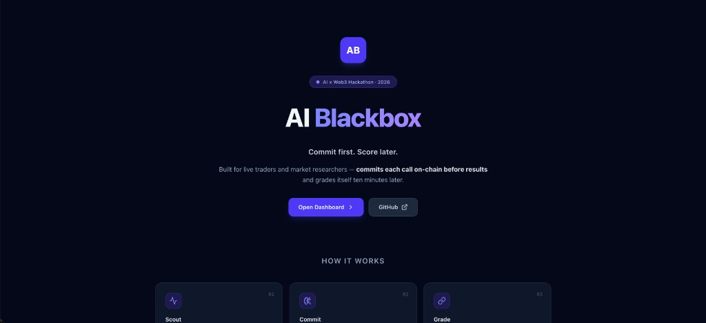
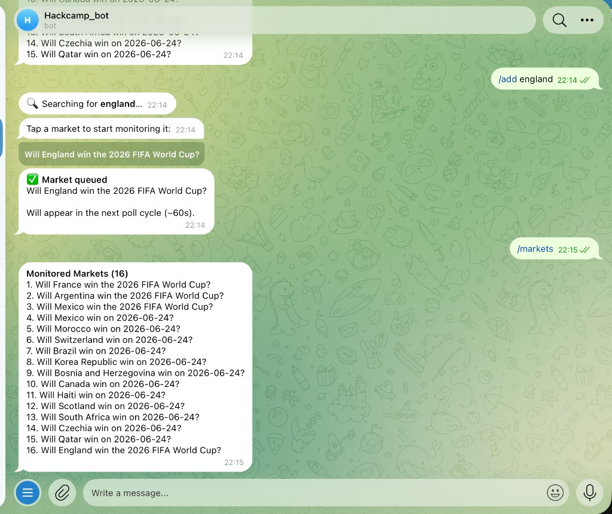
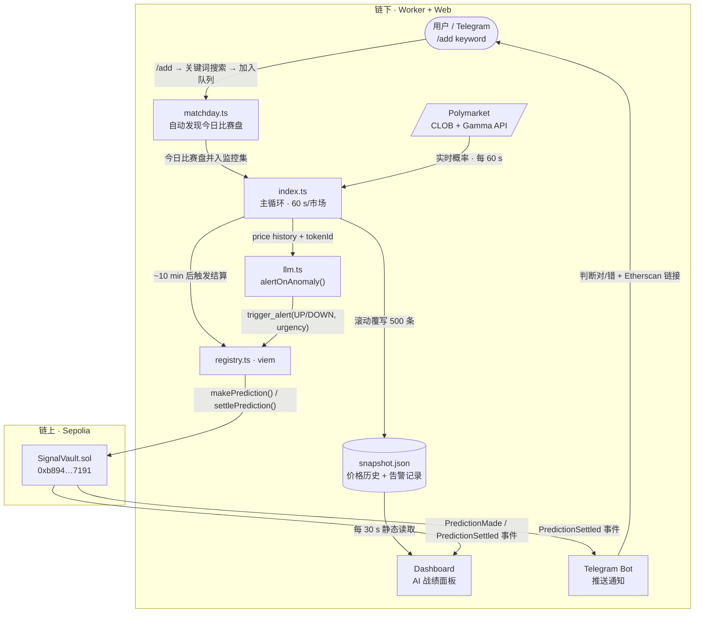
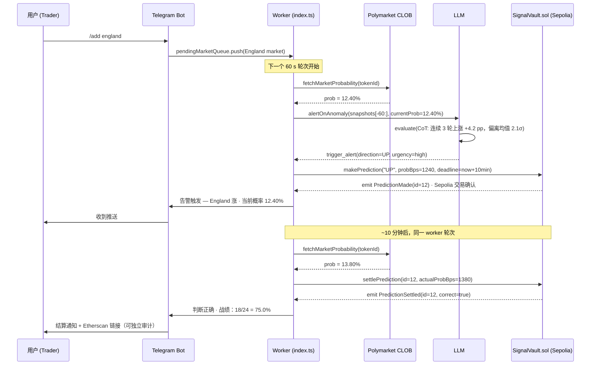

# AI Blackbox · 先签字，再计分

> 专为**赛中交易员和盘口研究员**而建——
> AI 在结果出来前把每次判断锁进区块链，10 分钟后自动结算，
> 用链上事件证明它到底准不准。

**当前状态：** 16 个世界杯市场实时监控 · SignalVault.sol 已部署 Sepolia · Telegram Bot 在线

[](https://ai-blackbox.vercel.app)
[](https://sepolia.etherscan.io/address/0xb894f59EE1531FA17cebb90D6d80E0A0fb597191)
[](https://github.com/ljwbpng09/ai-blackbox)
[](https://dorahacks.io/hackathon/croo-hackathon/detail)

---

## 为什么要做这个

### 真正的问题不是信息不够，是信号没法验证

比赛进行中，盘口每隔几秒就可能大幅跳动。
AI 告警工具在赛后总能声称"我早就判断到了"——但你从来没见过它**在结果出来前**的原话。
没有"先签字"的约束，AI 准确率不过是一个可以随时改写的数字。

### AI Blackbox 的做法只有一件事：先承诺，再计分

每次检测到价格异常，**AI Blackbox** 把方向（涨/跌）、当前概率和时间戳一起写进区块链，一字不能改。
10 分钟后系统自动用真实价格结算，更新链上履历。
你不需要信任我们——直接去 Etherscan 过滤 `PredictionMade` 和 `PredictionSettled` 事件，记录都在那里。

> Web2 也能记日志，但只有区块链能**证明**：没有中心化修改，没有事后解释，时间戳不可回滚。

---

## 演示

| 落地页 | Telegram Bot — 16 个市场实时在跑 |
|---|---|
|  |  |

- **在线地址：** [ai-blackbox.vercel.app](https://ai-blackbox.vercel.app)
- **链上合约：** [`0xb894...7191`](https://sepolia.etherscan.io/address/0xb894f59EE1531FA17cebb90D6d80E0A0fb597191) · Sepolia，可直接过滤事件审计
- **现场体验：** 向 [@Hackcamp_bot](https://t.me/Hackcamp_bot) 发送 `/add france`，下一个轮次（约 60 秒）该市场出现在监控列表

---

## 系统运作方式

### 整体架构



### 一次完整预测的时序



> 技术细节：[docs/architecture.md](docs/architecture.md) · 合约接口：[docs/contract.md](docs/contract.md)

---

## 技术栈

| 技术 | 用途 | 为什么选它，不选其他 |
|---|---|---|
| **Polymarket** CLOB + Gamma API | 实时价格 + 赛日市场自动发现 | 2026 世界杯日交易量 >$67M，是全球流动性最高的预测市场场所 |
| MiniMax LLM（OpenAI 兼容） | 价格异常检测 + Function Calling 决策 | 改一行 `baseURL` 即可切换任意供应商，不被单一 LLM 锁定 |
| Viem + Sepolia | 链上写入与读取 | 类型安全；`simulateContract` 广播前验证，杜绝无效 TX |
| SignalVault.sol | 两步预测生命周期 | 极简状态机：`makePrediction` → `settlePrediction`，Gas 低 |
| Next.js 15 App Router | Dashboard + 落地页 | Server Component 静态读取，零后端运营成本 |
| Telegram Bot API | 实时推送 + 互动指令 | `/add england` 可在演示中让评委亲手操作，是最直观的 Demo 钩子 |
| **CROO CAP** | A2A 商业化层 | 见下方「为 CROO 而建」章节 |

---

## 为 CROO 而建

**参赛赛道：** DeFi / On-chain Ops Agents · Data & Verification Agents

**核心论点：AI Blackbox 的链上履历，正是 CAP 需要的信任基础**

每一次 `settlePrediction` 事件都是一条公开、不可篡改的准确率数据点。
其他 Agent 在通过 CAP 雇用 AI Blackbox 之前，可以先查这份链上履历再决定值不值得付费——这是 Web2 API 给不了的信任基础。

**集成路径（W3-P5，黑客松提交期内完成）：**

```
任意 Agent（买方）
    │  CAP call: analyzeMarket(tokenId, budget=5 USDC)
    ▼
AI Blackbox Agent 端点
    │  执行 alertOnAnomaly()，返回 { direction, confidence, onChainProofId }
    ▼
买方用 onChainProofId 去 Etherscan 验证历史准确率，再决定下一步
```

**当前进度：** 链上逻辑（SignalVault.sol）和 AI 决策（alertOnAnomaly）均已完成并在跑；
CAP 端点封装——把函数暴露为可被其他 Agent 付费调用的服务——是最后一步冲刺。

---

## 为什么是现在，为什么是我们

**为什么是现在：** 2026 世界杯是 **Polymarket** 有史以来流动性最高的单体事件，峰值就在本月。
赛中盘口波动窗口极短，AI 信号需求是真实的。但整个行业验证 AI 准确率的能力还是零。
等世界杯结束，这个建立可验证基准的窗口就会关上。

**为什么是我们：** 三周内从零交付：多市场轮询、LLM 决策引擎、两步链上预测生命周期、
Telegram Bot（含实时 `/add` 命令）、自动赛日市场发现、全栈 Dashboard 上 Vercel。
每项功能都有链上 TX 或公开 URL 作为交付证明——不是幻灯片上的截图。

---

## 进度与规划

### 已完成

| 阶段 | 交付内容 | 证明 |
|---|---|---|
| W2-D1 | Polymarket 轮询 + Dashboard | [ai-blackbox.vercel.app/dashboard](https://ai-blackbox.vercel.app/dashboard) |
| W2-D4 | 两步预测生命周期 | [`0xb894...7191`](https://sepolia.etherscan.io/address/0xb894f59EE1531FA17cebb90D6d80E0A0fb597191) |
| W3-P2 | 多市场监控（16 个同时） | Dashboard 标签页切换 |
| W3-P3 | Telegram Bot 推送 + 结算通知 | @Hackcamp_bot |
| W3-P4 | 赛日市场自动发现（matchday.ts） | 每次启动自动检测 |
| W3-P4b | `/add <keyword>` 实时加市场 | 现场可演示 |

### 接下来 4 周

- **CROO CAP 端点**：将 `alertOnAnomaly` 包装为标准可付费 A2A 服务，上架 CROO Agent Store；里程碑：完成首个付费 A2A 调用
- **Track Record API**：开放 `/api/accuracy?tokenId=...`，让任意 Agent 付费前查历史胜率
- **Dashboard 一键审计**：每条预测直链对应 Etherscan TX，零摩擦验证

### 3–6 个月

- **Agent 信誉层**：Track Record 成为标准化信誉分，供 CAP 生态中的 Agent 选择信号提供商；目标：≥10 个外部 Agent 接入查询
- **多赛事扩展**：从世界杯复用至选举和体育锦标赛，保持「高流动性 + 短结算窗口」筛选标准；目标：≥3 个非世界杯市场累计 ≥100 次预测
- **CAP 订阅计费**：按市场 / 按赛季计费；目标：月度经常性 CAP 收入 >0

---

## 链接与许可

| | |
|---|---|
| 在线演示 | [ai-blackbox.vercel.app](https://ai-blackbox.vercel.app) |
| Dashboard | [ai-blackbox.vercel.app/dashboard](https://ai-blackbox.vercel.app/dashboard) |
| GitHub | [github.com/ljwbpng09/ai-blackbox](https://github.com/ljwbpng09/ai-blackbox) |
| 合约地址 | [`0xb894...7191`](https://sepolia.etherscan.io/address/0xb894f59EE1531FA17cebb90D6d80E0A0fb597191) on Sepolia |
| 黑客松 | [CROO Agent Hackathon — DoraHacks](https://dorahacks.io/hackathon/croo-hackathon/detail) |

**License:** MIT

> `WALLET_PRIVATE_KEY` 仅用于 Sepolia 测试网。`.env` 已加入 `.gitignore`，不会被提交。
