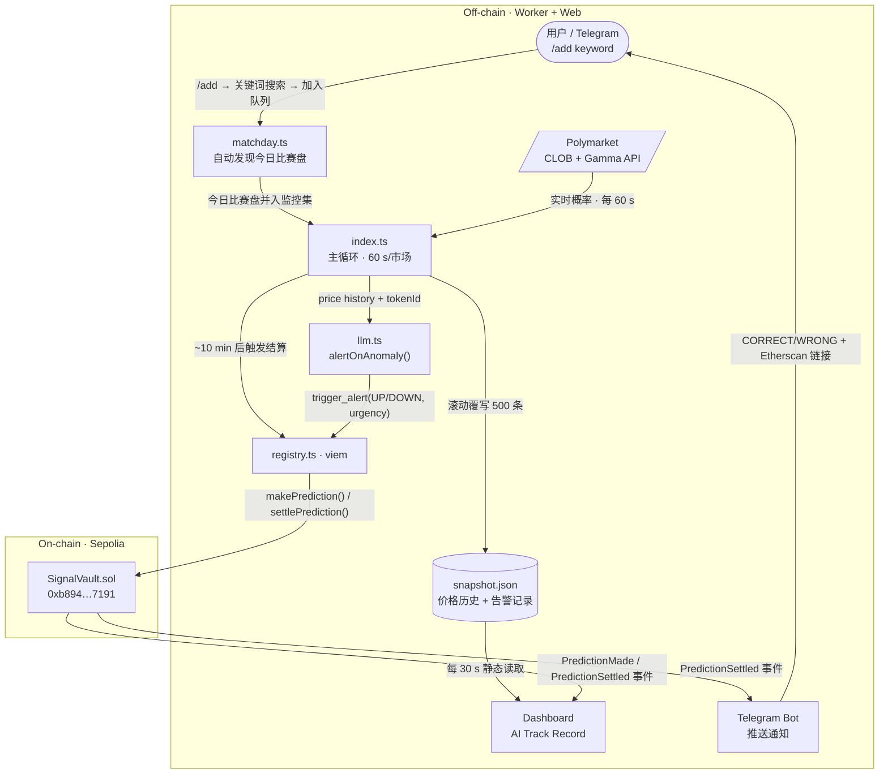
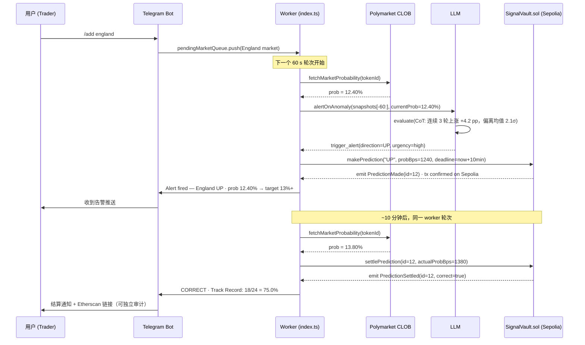

# AI Blackbox · 先签字，再计分

> **给赛中交易员和盘口研究员** — AI 在比赛结果出来前把判断锁进区块链，10 分钟后自动结算对错。
> 不是"AI 说它很准"，而是链上证明它准不准。

**当前状态：** 16 个世界杯市场实时监控 · SignalVault.sol 已部署 Sepolia · Telegram Bot 在线

[](https://ai-blackbox.vercel.app)
[](https://sepolia.etherscan.io/address/0xb894f59EE1531FA17cebb90D6d80E0A0fb597191)
[](https://github.com/ljwbpng09/ai-blackbox)
[](https://dorahacks.io/hackathon/croo-hackathon/detail)

---

## The Problem & The Solution

### 问题

赛中交易员面对的不是信息太少，而是**信号无法被验证**。
AI 告警工具可以事后声称"我早就知道"——但你从没见过它在结果前的原话。
没有"先签字"的约束，AI 准确率就是一个可以随时修改的数字。

### 解法

**AI Blackbox** 强制每次判断在结果出来前写进区块链：方向（UP/DOWN）、概率、时间戳，一字不能改。
10 分钟后系统自动拿真实价格结算，更新链上履历。
任何人可以直接去 Etherscan 过滤 `PredictionMade` + `PredictionSettled` 事件独立验证——不需要信任我们。

> Web2 也能记日志。只有区块链能**证明**：没有中心化修改，没有事后解释，时间戳不可回滚。

---

## Demo

| Landing Page | Telegram Bot — 16 markets live |
|---|---|
|  |  |

- **Live URL:** [ai-blackbox.vercel.app](https://ai-blackbox.vercel.app)
- **On-chain contract:** [`0xb894...7191`](https://sepolia.etherscan.io/address/0xb894f59EE1531FA17cebb90D6d80E0A0fb597191) on Sepolia — filter events to audit AI track record
- **Try it:** send `/add france` to [@Hackcamp_bot](https://t.me/Hackcamp_bot) — market appears in next poll cycle (~60 s)

---

## How it Works

### Architecture



### 单次预测时序



> 技术细节：[docs/architecture.md](docs/architecture.md) · 合约接口：[docs/contract.md](docs/contract.md)

---

## Tech Stack

| 技术 | 用途 | Why this, not alternatives |
|---|---|---|
| **Polymarket** CLOB + Gamma API | 价格数据源 + 赛日市场自动发现 | 2026 世界杯日交易量 >$67M，是验证 AI 准确率最有流动性的场所 |
| MiniMax LLM（OpenAI 兼容接口） | 价格异常检测 + Function Calling 决策 | 换 `baseURL` 一行切换供应商；不锁定任何单一 LLM |
| Viem + Sepolia | 链上写入与读取 | 类型安全；`simulateContract` 在广播前验证，防止无效 TX |
| SignalVault.sol | 两步预测生命周期 | 极简状态机：`makePrediction` → `settlePrediction`，Gas 成本低 |
| Next.js 15 App Router | Dashboard + Landing | Server Component 静态读取 snapshot.json，0 后端运营成本 |
| Telegram Bot API | 实时推送 + 互动指令 | `/add england` 可在演示现场实时操作，是最直观的 Demo 钩子 |
| **CROO CAP** | A2A 商业化层 | 见下方 "Built for CROO" 章节 |

---

## Built for CROO

**参赛赛道：** DeFi / On-chain Ops Agents · Data & Verification Agents

**为什么 AI Blackbox 是 CAP 的天然用例：**

AI Blackbox 的核心资产是**可验证的链上履历**。每一次 `settlePrediction` 事件都是一条公开的准确率数据点。
CAP 让其他 Agent 在雇用 AI Blackbox 之前，先查询这份履历来决定"这个信号值不值得付费"——这是 Web2 API 无法提供的信任基础。

具体集成路径（W3-P5，本黑客松提交期内完成）：

```
任意 Agent (buyer)
    │  CAP call: analyzeMarket(tokenId, budget=5 USDC)
    ▼
AI Blackbox Agent endpoint
    │  运行 alertOnAnomaly()，返回 {direction, confidence, onChainProofId}
    ▼
buyer 可用 onChainProofId 去 Etherscan 验证这个 Agent 的历史准确率
    再决定是否执行下一步操作
```

**当前状态：** 链上逻辑（SignalVault.sol）和 AI 决策（alertOnAnomaly）均已完成。
CAP 端点封装（将函数暴露为可被 Agent 付费调用的服务）为本次提交的最终冲刺任务。

---

## Why Now · Why This Team

**Why Now：** 2026 世界杯是 **Polymarket** 有史以来最大的单体事件，流动性峰值就在本月。
赛中盘口波动窗口极短，AI 信号需求真实存在，但整个行业对"AI 准确率"的核验能力为零。
这个空档在世界杯结束后会缩小——现在是做出可验证基准的最佳时间点。

**Why This Team：** 三周内从零完成：Polymarket 多市场轮询、LLM Function Calling 决策引擎、
两步链上预测生命周期、Telegram Bot 互动（含实时 `/add` 命令）、自动赛日市场发现（Plan B）、
全栈 Dashboard 上线 Vercel。每个功能都有对应的链上 TX 或公开可访问 URL 作为交付证明——不是 Demo 幻灯片。

---

## Roadmap

### Done（截至提交日）

| 阶段 | 交付物 | 链上 / 公开证明 |
|---|---|---|
| W2-D1 | Polymarket 轮询 + Dashboard | [ai-blackbox.vercel.app/dashboard](https://ai-blackbox.vercel.app/dashboard) |
| W2-D4 | 两步预测生命周期 | [`0xb894...7191`](https://sepolia.etherscan.io/address/0xb894f59EE1531FA17cebb90D6d80E0A0fb597191) |
| W3-P2 | 多市场监控（16 市场同时） | Dashboard 标签页 |
| W3-P3 | Telegram Bot 推送 + 结算通知 | @Hackcamp_bot |
| W3-P4 | 自动赛日市场发现（matchday.ts） | 每次启动自动检测 |
| W3-P4b | `/add <keyword>` 实时加市场 | 现场可演示 |

### Next 4 weeks（黑客松结束后）

- **CROO CAP 端点**：将 `alertOnAnomaly` 包装为标准 CAP 可调用服务，上架 CROO Agent Store；目标：首个付费 A2A 调用发生
- **Track Record API**：暴露 `/api/accuracy?tokenId=...` 端点，让任意 Agent 在付费前查询历史胜率
- **Dashboard 一键审计**：每条预测记录直接链接对应 Etherscan TX，实现 0 摩擦验证

### 3–6 months

- **Agent 信誉层**：Track Record 成为标准化信誉分，其他 Agent 在 CAP 市场中用它作为选择信号提供商的依据；成功指标：≥10 个外部 Agent 集成查询
- **多赛事扩展**：从世界杯复用到选举市场和体育锦标赛，保持"高流动性 + 短结算窗口"的筛选标准；成功指标：≥3 个非世界杯市场的 Track Record 累计 ≥100 次预测
- **CAP 订阅计费**：按市场 / 按赛季的订阅模型；成功指标：月度经常性 CAP 收入 >0

---

## Links · License

| | |
|---|---|
| Live Demo | [ai-blackbox.vercel.app](https://ai-blackbox.vercel.app) |
| Dashboard | [ai-blackbox.vercel.app/dashboard](https://ai-blackbox.vercel.app/dashboard) |
| GitHub | [github.com/ljwbpng09/ai-blackbox](https://github.com/ljwbpng09/ai-blackbox) |
| Contract | [`0xb894...7191`](https://sepolia.etherscan.io/address/0xb894f59EE1531FA17cebb90D6d80E0A0fb597191) on Sepolia |
| Hackathon | [CROO Agent Hackathon — DoraHacks](https://dorahacks.io/hackathon/croo-hackathon/detail) |

**License:** MIT — open source, forkable, composable.

> `WALLET_PRIVATE_KEY` 仅用于 Sepolia 测试网。`.env` 已加入 `.gitignore`，不会被提交。
