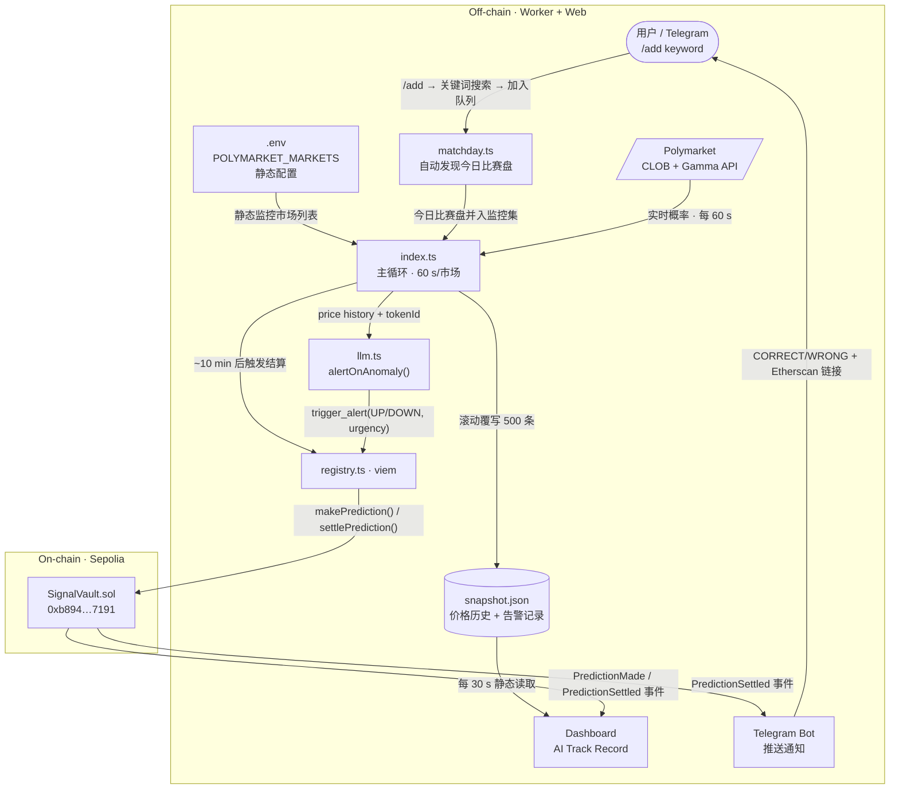
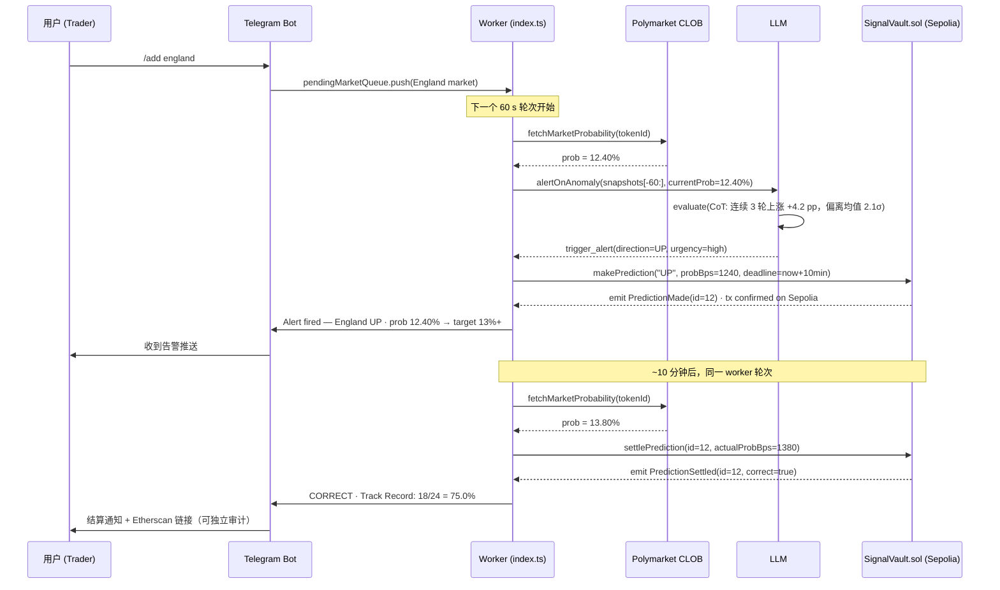

# AI Blackbox · 先签字，再计分

**AI Blackbox** 在结果前将每次判断封存上链，10 分钟后自动结算，输出任何人都可以独立审计的 AI 预测履历。

---

## 1. The Problem & The Solution

### 问题

赛中交易员和盘口研究员面对的不是信息太少，而是信号无法被验证。
AI 告警工具可以事后声称"我早就知道"——但你从没见过它在结果前的原话。
没有"先签字"的约束，AI 准确率就是一个可以随时修改的数字。

### 解法

**AI Blackbox** 强制 AI 在结果出来前把判断写进区块链：方向（UP/DOWN）、当前概率、时间戳，一字不能改。
10 分钟后系统自动拿真实价格结算，更新链上履历。
评委、用户、其他 Agent 都可以直接去 Etherscan 验证——不需要信任我们。

---

## 2. Demo

| Landing Page | Telegram Bot — 16 markets live |
|---|---|
|  |  |

- **Live URL:** [ai-blackbox.vercel.app](https://ai-blackbox.vercel.app)
- **On-chain contract:** [`0xb894...7191`](https://sepolia.etherscan.io/address/0xb894f59EE1531FA17cebb90D6d80E0A0fb597191) on Sepolia
- Filter `PredictionMade` + `PredictionSettled` events to audit the AI track record independently.

---

## 3. How it Works

### 架构图

### 单次预测时序

> 技术细节：[docs/architecture.md](docs/architecture.md) · 合约接口：[docs/contract.md](docs/contract.md)

---

## 4. Tech Stack

| 技术 | 用途 | Why |
|---|---|---|
| **Polymarket** CLOB + Gamma API | 价格数据源 + 赛日市场自动发现 | 最大预测市场，2026 世界杯赛季日交易量 >$67M |
| MiniMax LLM（OpenAI 兼容） | 价格异常检测 + 决策工具调用 | 一行换 `baseURL` 即可切换任意 OpenAI 兼容供应商 |
| Viem + Sepolia | 链上写入与读取 | 类型安全，无需私钥泄露风险的模拟调用 |
| SignalVault.sol | 两步预测生命周期 | `makePrediction` → `settlePrediction`，链上状态机 |
| Next.js 15 App Router | Dashboard + Landing | Server Component 静态读取 snapshot.json，0 后端成本 |
| Telegram Bot API | 实时推送 + 互动指令 | `/add england` 现场演示，评委可亲手操作 |
| **CROO CAP**（W3-P5） | A2A 商业化层 | 将 `alertOnAnomaly` 变成可被其他 Agent 付费调用的链上服务 |

---

## 5. Why Now · Why Us

**Why Now：** 2026 世界杯是 **Polymarket** 有史以来最大的单体事件，市场数量和流动性都在本月峰值。
赛中盘口波动窗口极短，AI 告警需求真实存在，但"AI 说它很准"没有任何可验证基础。
链上时间戳 + 不可篡改结算，是目前唯一能消除这个信任缺口的方案。

**Why Us：** 我们不是又一个"AI 提醒机器人"。
**AI Blackbox** 是业内第一个强制 AI 在结果前签字、并用智能合约自动评分的系统。
Track Record 不由我们维护——它由 Sepolia 上的事件日志维护，任何人可以独立复现。

---

## 6. Roadmap

### Done

| 阶段 | 完成内容 |
|---|---|
| W2-D1 | Polymarket 轮询、snapshot.json、Dashboard 折线图 |
| W2-D2 | LLM 异常检测 + 链上锚定（Sepolia） |
| W2-D3 | `decide()` 通用工具调用引擎 + `alertOnAnomaly` |
| W2-D4 | 两步预测生命周期：`PredictionMade` + `PredictionSettled` |
| W3-P0 | Web 部署到 Vercel，公开可访问 |
| W3-P1 | Dashboard AI Track Record 胜率统计 + 链上预测记录 |
| W3-P2 | 多市场监控，Dashboard 标签页切换 |
| W3-P3 | Telegram Bot：预测推送 + 结算通知 |
| W3-P4 | **Plan B**：`matchday.ts` 每轮自动发现今日比赛盘，零配置 |
| W3-P4b | Telegram `/add <keyword>`：关键词搜索 + 内联按钮，无需重启 |

### Next 4 weeks

- **W3-P5** — CROO CAP 集成：将 `alertOnAnomaly` 包装为可调用、可付费的 A2A Agent 端点，上架 CROO Agent Store
- 补充 Dashboard 历史预测列表中的 Etherscan 跳转链接，实现一键审计
- 录制 Demo 视频（≤5 min），满足 CROO 提交要求

### 3–6 months

- 将 Track Record 作为可查询的 Agent 信誉分，供其他 Agent 在付费前评估信号质量
- 扩展到世界杯之外的高流动性预测市场（选举、赛事结局）
- 探索 **CROO** Agent Store 订阅模式：按市场、按赛季计费

---

## 7. Links · Contact · License

| | |
|---|---|
| Live Demo | [ai-blackbox.vercel.app](https://ai-blackbox.vercel.app) |
| Dashboard | [ai-blackbox.vercel.app/dashboard](https://ai-blackbox.vercel.app/dashboard) |
| GitHub | [github.com/ljwbpng09/ai-blackbox](https://github.com/ljwbpng09/ai-blackbox) |
| Contract | [`0xb894...7191`](https://sepolia.etherscan.io/address/0xb894f59EE1531FA17cebb90D6d80E0A0fb597191) on Sepolia |
| Hackathon | [CROO Agent Hackathon — DoraHacks](https://dorahacks.io/hackathon/croo-hackathon/detail) |

**License:** MIT — open source, forkable, composable.

> Security: `WALLET_PRIVATE_KEY` is Sepolia testnet only. `.env` is gitignored and never committed.
> See [docs/security.md](docs/security.md) for full threat model.
